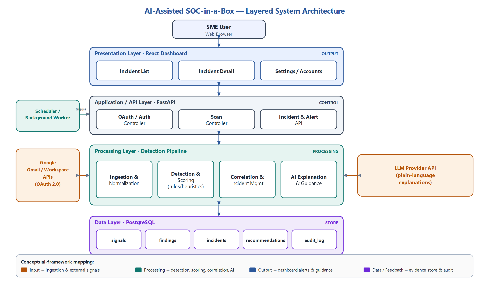
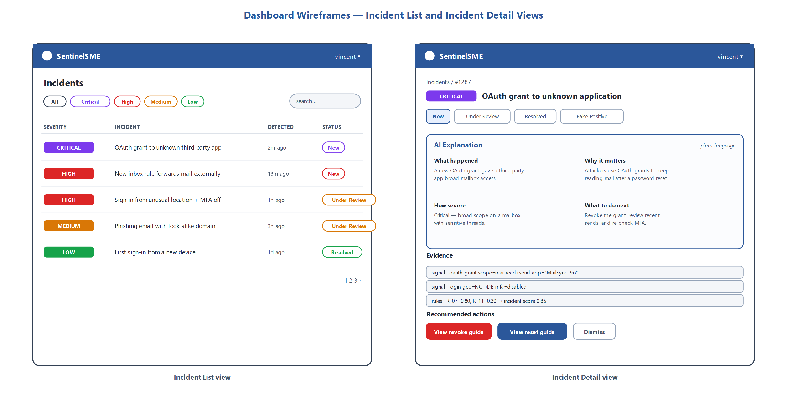
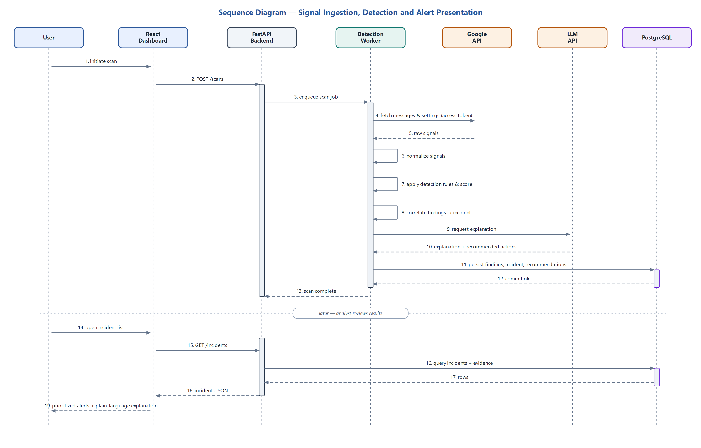

# SentinelSME

[](https://github.com/Vince106888/ai-soc-prototype/actions/workflows/ci.yml)

SentinelSME is a privacy-aware, AI-assisted SOC-in-a-box research prototype for
individuals, micro-organisations, and small businesses that use cloud email but
do not have a dedicated security analyst. It turns authorised or controlled
email and account-security signals into traceable, prioritised incidents with
plain-language explanations and safe next steps.

The platform is defensive by design. Rules create findings, transparent maths
sets priority, and a human decides what happens next. No model is allowed to
create evidence, change a score, or take action on an account.



## Platform status

This repository now contains an end-to-end **controlled-data** workflow:

- persistent accounts, sources, scan jobs, signals, rules, findings, incidents,
  explanations, recommendations, and audit records;
- normalisation and deterministic detection for email, forwarding, sign-in,
  MFA, and OAuth-grant signals;
- idempotent batch ingestion, 30-minute correlation, bounded risk aggregation,
  incident lifecycle controls, and tenant-scoped retrieval;
- a versioned FastAPI surface plus the original single-message analysis route;
- a React dashboard for overview, incident triage, evidence review, lifecycle
  changes, and coverage visibility;
- template explanations and safe advisory actions;
- a labelled-case evaluation endpoint that reports a confusion matrix and
  accuracy, precision, recall, specificity, and F1 score.

Some interfaces intentionally stop short of live operations. Gmail/Google
Workspace OAuth and collection, a running scheduler/worker, external AI
explanations, automatic remediation, and production identity management are
**not implemented**. Creating a scan job records work; it does not fetch a
mailbox. See the [capability matrix](docs/CAPABILITY_MATRIX.md) for the exact
boundary.

## Why it exists

Native cloud alerts are often spread across inboxes, browser warnings, identity
dashboards, and administrator consoles. Enterprise SIEM and SOC products can
centralise this information, but their cost and operating complexity are often
unrealistic for a small organisation. SentinelSME explores a narrower question:

> Can selected cloud-email and account-security indicators be collected with
> consent, correlated transparently, and explained well enough for a
> non-specialist to take timely defensive action?

The prototype focuses on the evidence path, not on claiming certainty:

```text
controlled signal -> minimise and normalise -> deterministic rules
                  -> findings -> correlate -> score and prioritise
                  -> explanation + safe guidance -> human review -> audit
```

## What users can do

- Register a controlled account and one or more sources.
- Submit up to 500 controlled signals in an ingestion batch.
- Review incidents ordered by severity and filter them by severity, status,
  account, or search text.
- Trace an incident back to its normalised signals, rules, weights, confidence,
  and supporting evidence.
- Move an incident through valid review states with an audit note.
- Inspect the configured detection catalogue and platform capability report.
- Run labelled evaluation cases without persisting private message content.

The dashboard follows the incident-list and evidence-first detail design from
the project report:



## Architecture

SentinelSME is a modular monolith with explicit service boundaries:

| Layer | Current implementation |
|---|---|
| Presentation | React/Vite single-page dashboard |
| HTTP/API | FastAPI health, compatibility analysis, and `/api/v1` platform routes |
| Processing | Normalisation, configurable rules, scoring, correlation, lifecycle, templates, evaluation |
| Persistence | SQLAlchemy; SQLite by default and PostgreSQL-compatible configuration |
| External integrations | Modelled as capabilities; live Google and LLM connectors are not included |



The default SQLite database is created at `data/sentinelsme.db`. Set
`AI_SOC_DATABASE_URL` to use another SQLAlchemy database URL. The repository
ships an Alembic migration and a Docker Compose deployment that builds the
dashboard and API and runs them with PostgreSQL.

See [DATA_MODEL.md](docs/DATA_MODEL.md) for the persisted evidence chain and
[OPERATIONS.md](docs/OPERATIONS.md) for deployment boundaries.

## Quick start

### Prerequisites

- Python 3.13
- [uv](https://docs.astral.sh/uv/)
- Node.js 20.19+ or 22.12+ and npm for the dashboard

### 1. Start the API

```bash
git clone https://github.com/Vince106888/ai-soc-prototype.git
cd ai-soc-prototype
uv sync --dev --frozen
uv run alembic upgrade head
uv run uvicorn app.main:app --reload
```

Open [http://127.0.0.1:8000/docs](http://127.0.0.1:8000/docs) for the generated
OpenAPI interface. Liveness is available at
[http://127.0.0.1:8000/health](http://127.0.0.1:8000/health), while
`/health/ready` also verifies database reachability.

### 2. Start the dashboard

In a second terminal:

```bash
cd frontend
npm ci
npm run dev
```

Open [http://127.0.0.1:5173](http://127.0.0.1:5173). The development server
proxies `/api` to `http://127.0.0.1:8000`. Set `VITE_API_BASE_URL` when the API
is exposed through a same-origin reverse proxy at another base path.

To seed the labelled controlled scenario pack into the local database:

```bash
uv run python -m app.demo
```

For a containerised PostgreSQL deployment, copy `.env.example` to `.env`, set
both secrets, then run `docker compose up --build`. The console and API are
served together at [http://localhost:8000](http://localhost:8000).

### 3. Create controlled data

The fastest guided path is the API documentation. A minimal sequence is:

1. `POST /api/v1/accounts`
2. `POST /api/v1/accounts/{account_id}/sources`
3. `POST /api/v1/scan-jobs`
4. `POST /api/v1/sources/{source_id}/signals`
5. `GET /api/v1/incidents`
6. `GET /api/v1/incidents/{incident_id}`
7. `PATCH /api/v1/incidents/{incident_id}/status`

Every request under `/api/v1` accepts an `X-Tenant-ID` header; it defaults to
`default`. If `AI_SOC_API_KEY` is configured, the same routes also require its
value in `X-API-Key`. These headers provide a controlled prototype boundary,
not production user identity or enterprise multi-tenancy.

The original `POST /analyze` route remains available for a stateless,
single-message demonstration using `fixtures/suspicious_email.json`.

Full request examples and endpoint semantics are in [API.md](docs/API.md).

## Detection catalogue

The persistent pipeline seeds eleven versioned deterministic rules:

| Rule | Signal | Indicator | Weight | Confidence |
|---|---|---|---:|---:|
| `EMAIL-001` | email | Reply-to domain differs from sender domain | 0.45 | 0.95 |
| `EMAIL-002` | email | Urgent or credential-seeking language | 0.30 | 0.85 |
| `URL-001` | email | Known URL-shortening host | 0.30 | 0.98 |
| `URL-002` | email | Credential-themed hostname label | 0.45 | 0.80 |
| `EMAIL-003` | email | Sender domain resembles a declared trusted domain | 0.65 | 0.85 |
| `EMAIL-004` | email | Recognised brand name conflicts with the sender domain | 0.55 | 0.85 |
| `EMAIL-005` | email | SPF, DKIM, or DMARC authentication failure | 0.55 | 0.95 |
| `FORWARD-001` | forwarding | Enabled, external, unauthorised forwarding | 0.70 | 0.95 |
| `SIGNIN-001` | sign-in | Unusual, new-device, impossible-travel, or high-risk sign-in | 0.65 | 0.80 |
| `MFA-001` | MFA | Multi-factor authentication disabled | 0.60 | 0.99 |
| `OAUTH-001` | OAuth grant | Broad or unverified third-party grant | 0.80 | 0.90 |

Rules persist only the evidence fields they need. For email signals, the body is
reduced to matched phrases; URLs are reduced to canonical hostnames. Submitted
URLs are never fetched.

The legacy `/analyze` endpoint uses a separate historical 0–100 additive scale.
Do not compare that score directly with persistent incident scores. The full
catalogue and both scoring contracts are documented in
[RULE_CATALOG.md](docs/RULE_CATALOG.md).

## Scoring, correlation, and lifecycle

Persistent incident scores use bounded accumulation:

```text
combined score = 1 - product(1 - finding weight)
```

For example, related findings weighted `0.80` and `0.30` produce
`1 - (0.20 x 0.70) = 0.86`. This rewards corroborating evidence without letting
many weak findings push the score above `1.00`. A score is a review priority,
not the probability that an attack occurred.

| Score | Severity | Interpretation |
|---:|---|---|
| 0.00–0.29 | Low | Weak or isolated evidence; review when practical |
| 0.30–0.59 | Medium | Confirm whether the activity was expected |
| 0.60–0.79 | High | Prompt investigation required |
| 0.80–1.00 | Critical | Immediate review and containment guidance required |

Findings correlate only when they belong to the same account, share a
correlation key, and fall within the 30-minute window. Valid user transitions
are:

```text
New ---------> Under review ---------> Resolved
 |                   |                    |
 +--> False positive +--> False positive +--> Under review (reopen)
```

New related evidence automatically reopens a resolved incident. Every accepted
transition is written to the audit log.

## Privacy and security

The repository is for synthetic, controlled, or explicitly authorised data.
Do not submit real credentials, access tokens, private mailboxes, malware, or
third-party data without permission.

Implemented safeguards include:

- strict request contracts, bounded fields and batches, and unknown-field
  rejection;
- no attachment or raw-message fields in persistent signal ingestion;
- feature minimisation before persistence;
- idempotency through stable source/external identifiers and fingerprints;
- tenant-scoped platform queries and optional constant-time API-key checking;
- host allow-listing, one-megabyte body limits, redacted validation failures,
  no-store responses, and defensive browser headers;
- deterministic templates when no AI service exists;
- an evidence and audit trail for every persisted incident.

Important limitations remain: `X-Tenant-ID` is caller-supplied, the API key is a
shared deployment secret, database encryption and TLS depend on the operator,
and there is no production identity provider, rate limiter, automated retention
job, or OAuth token vault. Read [PRIVACY_AND_RETENTION.md](docs/PRIVACY_AND_RETENTION.md)
and [SECURITY.md](SECURITY.md) before deployment.

## Evaluation

The project evaluates both technical correctness and alert usefulness. The
implemented `/api/v1/evaluation` endpoint runs labelled controlled signals and
returns a confusion matrix plus accuracy, precision, recall, specificity, and
F1. Unit and API tests cover validation, rules, scoring, idempotency, tenant
isolation, lifecycle transitions, persistence, filters, and failure paths.

Report-level targets still requiring a documented study include:

- process up to 500 prepared message records and surface results within five
  minutes on the development computer;
- have at least 80% of evaluation participants identify the highest-priority
  incident, its reason, and the next step within three minutes unaided;
- calibrate weights and thresholds against a representative labelled set.

See [EVALUATION.md](docs/EVALUATION.md) for reproducible commands and the
difference between automated coverage and research evidence.

## Development checks

```bash
uv sync --dev --frozen
uv run ruff check .
uv run pytest --cov=app --cov-report=term-missing

cd frontend
npm ci
npm run lint
npm test
npm run build
```

Do not commit generated databases, credentials, tokens, real mailbox exports,
or screenshots containing private data. Read [AGENTS.md](AGENTS.md) and
[CONTRIBUTING.md](CONTRIBUTING.md) before changing the system.

## Documentation index

| Document | Purpose |
|---|---|
| [Capability matrix](docs/CAPABILITY_MATRIX.md) | Honest implemented/partial/not-implemented boundary |
| [API reference](docs/API.md) | Routes, headers, schemas, and controlled workflow |
| [Data model](docs/DATA_MODEL.md) | Tables, relationships, invariants, and evidence chain |
| [Rule catalogue](docs/RULE_CATALOG.md) | Normalisation, rules, scoring, correlation, lifecycle |
| [Privacy and retention](docs/PRIVACY_AND_RETENTION.md) | Data boundary, retention gaps, operator duties |
| [Evaluation](docs/EVALUATION.md) | Test strategy, metrics, and research targets |
| [Operations](docs/OPERATIONS.md) | Configuration, startup, monitoring, and deployment caveats |
| [Threat model](docs/THREAT_MODEL.md) | Assets, trust boundaries, threats, and mitigations |
| [Requirements traceability](docs/REQUIREMENTS_TRACEABILITY.md) | Chapter 4 requirements mapped to implementation evidence |
| [Roadmap](docs/ROADMAP.md) | Completed work and remaining delivery phases |

## Scope and limitations

SentinelSME is not an enterprise SIEM, endpoint detection platform, packet
sensor, malware sandbox, phishing simulator, compliance product, or substitute
for professional incident response. A rule match is an indicator for human
review, not proof of malicious activity. Recommendations remain advisory.

The design supports three input profiles, but only the controlled profile is
operational today:

| Input profile | Status | Intended signals |
|---|---|---|
| Controlled evaluation data | Implemented | Email, link, forwarding, sign-in, MFA, and OAuth-grant scenarios |
| Personal Gmail | Not connected | Authorised message metadata, sender data, links, labels |
| Workspace administrator | Not connected | Mailbox plus permitted login, forwarding, grant, and posture data |

## Research provenance

The product scope and architecture are derived from *An Intelligent
Cybersecurity Monitoring and Alerting System for Small-Scale Digital
Environments* by Vincent Nyamao (admission number 106888), including the final
Chapters 1–3 proposal and the revised Chapter 4 analysis and design report. The
diagrams under `docs/assets/` are copied from the original Chapter 4 design
artifacts; see [docs/assets/README.md](docs/assets/README.md) for exact source
paths and integrity hashes.

Research diagrams describe the intended architecture. This README and the
capability matrix are the authority for what the repository actually executes.
