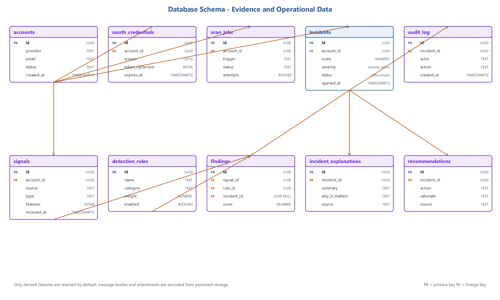

# Data Model and Evidence Chain

SentinelSME stores the minimum structured evidence needed to reproduce a
finding, explain an incident, and evaluate the rules. SQLite is the development
default; the ORM is designed to remain portable to PostgreSQL.



The diagram is the research design. The executable model adds explicit tenant,
source, confidence, fingerprint, and timestamp fields and intentionally omits
OAuth credentials until a secure live connector exists.

## Persisted entities

| Entity/table | Purpose | Important fields |
|---|---|---|
| `accounts` | Monitored account within a tenant | `tenant_id`, email, provider, profile, status |
| `sources` | Controlled or future cloud input | account, type, external ID, status, capabilities |
| `scan_jobs` | Requested unit of collection work | source, trigger, status, attempts, counts, error, timestamps |
| `signals` | Privacy-minimised normalised event | source/account, external ID, type, time, correlation key, JSON features, fingerprint |
| `detection_rules` | Versioned deterministic rule configuration | code, signal type, title, weight, confidence, enabled, configuration, version |
| `findings` | One rule match against one signal | signal, rule code, optional incident, evidence, weight, confidence |
| `incidents` | Correlated review unit | account/key, title, summary, score, confidence, severity, status, time range |
| `incident_explanations` | Four-part human-readable explanation | incident, source (`template` or future `ai`), structured content |
| `recommendations` | Ordered safe next steps | incident, position, action, advisory flag |
| `audit_log` | Review and system history | tenant, optional incident, actor, action, state change, detail, time |

## Relationships

```text
Tenant header (logical boundary)
  -> Account
      -> Source
          -> ScanJob
          -> Signal
              -> Finding -> DetectionRule
                   \-> Incident
                        -> IncidentExplanation
                        -> Recommendation
                        -> AuditRecord
```

A finding can temporarily have no incident while correlation is incomplete.
The detail API reconstructs the evidence chain without duplicating source data
inside the explanation.

## Core invariants

1. `(tenant_id, account email)` is unique.
2. `(tenant_id, source external_id)` is unique.
3. `(source_id, signal external_id)` is unique, making ingestion idempotent.
4. `(signal_id, rule_code)` is unique, so one rule cannot duplicate a finding
   for the same signal.
5. Account, source, job, incident, and audit queries are tenant-scoped.
6. An incident belongs to one account and one correlation key.
7. Finding weights and evidence are copied at detection time so later rule
   changes do not rewrite historical reasoning.
8. Recommendations are advisory and ordered.
9. Every accepted user lifecycle change produces an audit record.

## Normalised signal boundary

`signals.features` is JSON because each supported signal type has different
features. The persisted representation is deliberately smaller than the input:

| Signal | Retained examples | Removed or reduced |
|---|---|---|
| Email | canonical sender/reply-to, domains, display name, subject, labels, URL hosts, matched terms | Full body reduced to matched phrases; URL paths removed; attachments rejected |
| Forwarding | target address/domain, enabled, external, authorised | No mailbox body or credentials |
| Sign-in | source IP/country, device/travel/risk flags, success | No password, cookie, or token |
| MFA | enabled and method count | No secret seed or recovery material |
| OAuth grant | app name/ID, verified/broad flags, broad scope categories | No access/refresh token and no full token material |

The API rejects `attachment`, `attachments`, `attachment_content`, and
`raw_message` keys. Applications integrating with the platform must minimise
data before submission rather than using the database as a mailbox archive.

## Database configuration

The default URL is effectively:

```text
sqlite:///data/sentinelsme.db
```

Override it with `AI_SOC_DATABASE_URL`. Foreign-key enforcement is enabled for
SQLite connections. Application startup and the container entrypoint apply the
checked-in Alembic migration. Production operators must still add backups,
storage encryption, and retention automation before accepting live data.

## Target model not yet implemented

The Chapter 4 report includes an `oauth_credentials` table containing encrypted
token material and approved scopes. This table is deliberately absent from the
current executable model because the live OAuth connector, key management, and
token lifecycle are not implemented. Do not introduce token persistence without
updating the threat model, privacy documentation, migrations, and security tests.
