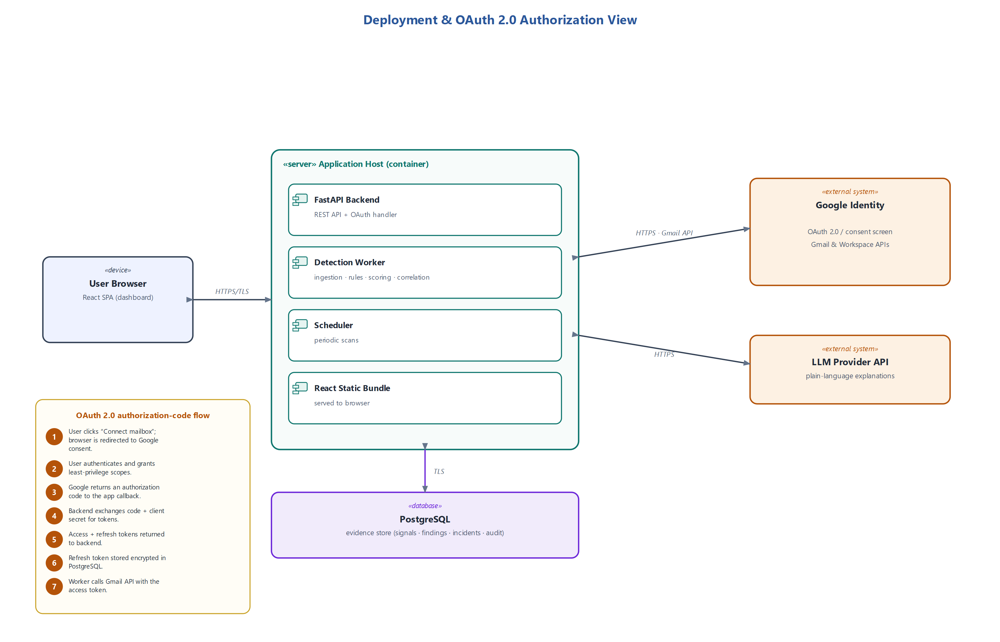

# Operations Guide

This runbook covers the current local/research deployment. It does not claim
production readiness.

## Runtime layout



The report diagram shows the target boundary. Today, run these components:

```text
Browser -> Vite dashboard (development) -> FastAPI -> SQLite/PostgreSQL
                                      \-> deterministic processing in-process
```

There is no live Google connector, OAuth handler/token vault, external LLM
adapter, scheduler process, or background worker. Scan-job rows are orchestration
records consumed when controlled signals are submitted.

## Configuration

| Variable | Default | Purpose |
|---|---|---|
| `AI_SOC_DATABASE_URL` | `sqlite:///data/sentinelsme.db` | SQLAlchemy database URL |
| `AI_SOC_ALLOWED_HOSTS` | `localhost,127.0.0.1,testserver` | Comma-separated accepted Host headers |
| `AI_SOC_API_KEY` | unset | When set, required as `X-API-Key` on `/api/v1` |
| `VITE_API_BASE_URL` | empty | Browser API origin; empty uses Vite proxy/same origin |

Do not place secrets in committed `.env` files. The dashboard keeps a configured
API key in the browser session only; that still exposes it to anyone who can
inspect that browser session and is not a production authentication design.

## Local startup

API:

```bash
uv sync --dev --frozen
uv run alembic upgrade head
uv run uvicorn app.main:app --reload --host 127.0.0.1 --port 8000
```

Dashboard:

```bash
cd frontend
npm ci
npm run dev
```

The dashboard is served at `http://127.0.0.1:5173`; the API and OpenAPI UI are
at `http://127.0.0.1:8000` and `http://127.0.0.1:8000/docs`.

## Health and capability checks

```powershell
Invoke-RestMethod http://127.0.0.1:8000/health
Invoke-RestMethod http://127.0.0.1:8000/health/ready
Invoke-RestMethod http://127.0.0.1:8000/api/v1/capabilities
```

If `AI_SOC_API_KEY` is enabled, pass `-Headers @{ 'X-API-Key' = '...' }` to the
capability call. A healthy process does not prove that an external connector is
available; inspect the capability response before enabling UI paths.

## Database operations

The SQLite default is suitable for a single local demo. Stop the API before
copying the database for backup or moving it between machines. Protect a backup
as sensitive evidence even though message bodies and attachments are excluded.

For PostgreSQL, use a least-privilege application role, TLS, encrypted storage,
private network access, and a separately managed backup policy. The checked-in
Alembic migration owns schema creation; deployment-specific backup and restore
testing is still required.

## Container startup

Copy `.env.example` to `.env`, replace both example secrets, and run:

```bash
docker compose up --build
```

The multi-stage image builds the React console, installs the locked Python
runtime, applies Alembic migrations, and serves the console and API on port
`8000`. PostgreSQL is private to the Compose network and stores data in the
named `sentinelsme-data` volume.

Automated retention is not available. Plan and document deletion before using
real data; see `PRIVACY_AND_RETENTION.md`.

## Operational states

Scan jobs use `queued`, `running`, `completed`, or `failed`. Controlled ingestion
with a matching job moves it to running and then completed and updates import,
duplicate, and finding counts. With no worker, an unconsumed queued job remains
queued. A failed controlled ingestion marks its matching job `failed`; after
correcting the source or payload, explicitly queue it again with
`POST /api/v1/scan-jobs/{job_id}/retry`.

Sources use `active` or `disconnected`. A disconnected source cannot start a new
job or ingest signals. Re-activating a record changes local eligibility only; it
does not establish a remote provider connection.

## Monitoring and troubleshooting

| Symptom | Check |
|---|---|
| `400` from every request | Host header is absent from `AI_SOC_ALLOWED_HOSTS` |
| `401` under `/api/v1` | `AI_SOC_API_KEY` is set and `X-API-Key` is missing/wrong |
| Resource appears missing | Request uses a different `X-Tenant-ID` |
| `409` creating/ingesting | Duplicate stable identifier, disconnected source, mismatched scan/source, or invalid transition |
| Job stays queued | No worker exists; submit controlled signals with its job ID |
| No incident appears | No enabled rule met the 0.10 finding threshold |
| Repeated signal adds nothing | Same source and external ID is intentionally idempotent |
| No AI prose | Expected; current explanation source is `template` |

Failed external calls must never be represented as a clean scan when live
connectors are added. Bound and sanitise stored error text.

## Production-readiness gate

Before any internet-facing or live-mail deployment, add and verify:

- real user authentication and server-derived tenant identity;
- role-based authorisation;
- TLS termination, secure proxy headers, and request/rate limits;
- reviewed database migrations and rollback procedure;
- encryption and rotation for provider token material;
- least-privilege OAuth consent, disconnect, expiry, and revocation;
- scheduled-worker ownership, retry policy, and dead-letter handling;
- automated retention/deletion and backup restoration testing;
- metrics, structured redacted logs, alerting, and incident response;
- dependency, secret, and container scanning;
- representative security, load, and usability evidence.

Until then, bind services to localhost or a controlled lab network and use only
synthetic or explicitly authorised data.
