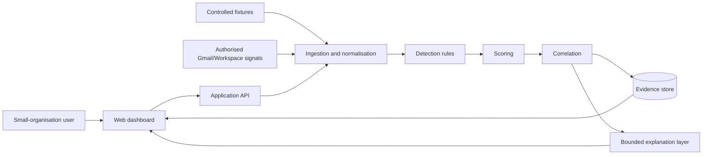
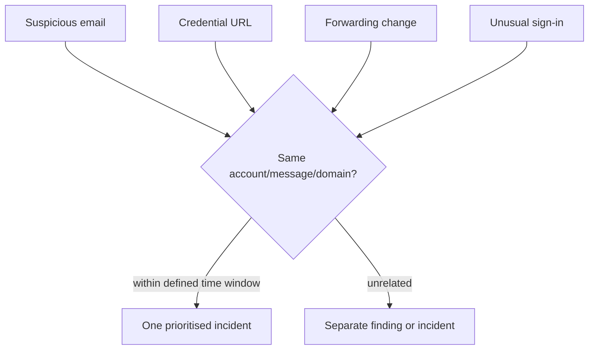
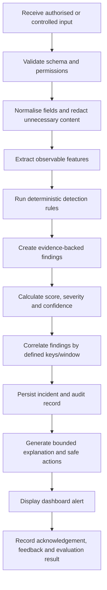

# AI-SOC Prototype: What We Are Building

## Executive definition

AI-SOC is a **browser-accessible web application** for defensive cybersecurity monitoring. It is designed for small organisations that use cloud email and online accounts but do not have a dedicated security analyst.

It is a complete **research prototype** composed of a backend analysis service, a web dashboard, controlled storage, optional cloud integration, and an evaluation harness. It is not a native Android/iOS application, a general-purpose enterprise SIEM, or an autonomous incident-response platform.

## The product in one sentence

> The system collects selected authorised or controlled cloud-email/account signals, detects suspicious indicators with transparent rules, combines related findings into prioritised incidents, and presents evidence-backed explanations and safe next actions through a web dashboard.

## What the user sees

The user opens a dashboard in a browser and sees:

- incidents ordered by severity and status;
- the affected message, account or security event;
- the indicators that caused the finding;
- separate severity and confidence values;
- a plain-language explanation;
- safe recommended actions;
- acknowledgement and resolution status;
- an audit trail of important changes.

The first user workflow is:

```text
Open dashboard
    -> review prioritised incident
    -> inspect evidence
    -> read explanation
    -> follow safe recommended action
    -> acknowledge or resolve
```

## System boundary



The boundary deliberately excludes endpoint telemetry, packet capture, malware execution, credential collection, unrestricted surveillance, complete multi-platform coverage, and autonomous account changes.

## Components

### 1. Web dashboard

The dashboard is the presentation layer. It does not independently decide whether an email is malicious. It requests incidents and findings from the backend and presents them in a form a non-specialist can understand.

### 2. Application API

The API is the controlled entry point for the dashboard and ingestion adapters. It validates input, enforces authorisation, invokes the analysis pipeline, and returns structured results.

Initial endpoint:

```http
POST /analyze
Content-Type: application/json
```

The first endpoint accepts a controlled message fixture. Later endpoints will support incident listing, incident details, acknowledgement, evaluation runs and capability status.

### 3. Ingestion and normalisation

The ingestion layer accepts data from two sources:

1. controlled JSON fixtures used for reproducible development and evaluation;
2. selected user-authorised Gmail/Google Workspace signals, if the test account and API scopes expose them.

Both sources must be converted into the same internal schema. This means detection logic does not depend on whether an event came from a live API or a controlled fixture.

### 4. Detection engine

The first detection engine is deterministic. Each rule emits a finding with:

- rule identifier;
- finding title;
- observable evidence;
- score contribution;
- confidence or data-quality note;
- source identifier.

Initial rules include:

- sender/reply-to domain mismatch;
- urgent or credential-seeking language;
- shortened URL use;
- credential-themed hostname labels;
- later, domain similarity, authentication results, forwarding changes and selected posture weaknesses.

Rules are not claims of certainty. They are indicators that must be interpreted with evidence, confidence and limitations.

### 5. Scoring engine

The initial score is a transparent additive score:

```text
score = min(100, sum(weight for each triggered finding))
```

Example:

| Indicator | Weight |
|---|---:|
| Reply-to domain mismatch | 25 |
| Urgent/credential-seeking language | 20 |
| Shortened URL | 20 |
| Credential-themed hostname | 25 |

Severity is derived from the score using documented thresholds. Severity, confidence and urgency must remain separate concepts:

- **severity:** potential consequence if the finding is genuine;
- **confidence:** confidence that the indicator has been correctly detected;
- **urgency:** how quickly the user should act.

The weights and thresholds are provisional until calibrated against the labelled scenario set.

### 6. Correlation engine

Correlation prevents the dashboard from presenting several related weak findings as unrelated alerts.



The correlation design will document:

- correlation keys such as account, message, URL, sender and time;
- the time window;
- duplicate handling;
- score aggregation;
- incident opening, updating, acknowledgement and closure.

### 7. Explanation layer

The explanation layer receives structured findings, not unrestricted authority. It produces plain-language explanations and response guidance.

```text
Rule evidence
    -> approved explanation template or constrained AI prompt
    -> validated explanation
    -> approved action catalogue
    -> user-facing guidance
```

AI is assistive rather than authoritative. It must not execute actions, override detection evidence, invent unavailable telemetry, or treat instructions inside email content as system instructions.

### 8. Evidence store

The prototype stores the minimum data needed to reproduce incidents and evaluation results. Candidate entities are:

```text
Account
AuthorisationGrant
Message
UrlIndicator
SecurityEvent
Finding
Incident
ResponseGuidance
AuditRecord
EvaluationCase
```

Raw message content should be avoided or redacted where structured metadata is sufficient. Retention and deletion rules will be documented before live data is used.

## End-to-end algorithm



Pseudocode:

```text
function analyse(input):
    assert authorised_or_controlled(input)
    normalised = normalise(input)
    features = extract_features(normalised)
    findings = []

    for rule in enabled_rules:
        if rule.matches(features):
            findings.append(rule.to_finding(features))

    score = cap(sum(finding.weight for finding in findings), 100)
    severity = severity_for(score)
    incident = correlate(normalised, findings, score)
    explanation = explain_structured_evidence(incident)
    actions = approved_actions_for(incident)
    persist(incident, findings, explanation, actions)
    return incident
```

## Example

Input:

```json
{
  "sender": "Support <support@example.com>",
  "reply_to": "recovery@unknown.test",
  "subject": "Urgent: verify your account",
  "body": "Your account is suspended. Click here immediately.",
  "urls": ["https://bit.ly/example", "https://secure-account.test/login"]
}
```

Output concept:

```text
Score: 90
Severity: critical

Findings:
- Reply-to domain mismatch
- Urgent or credential-seeking language
- Shortened URL
- Credential-themed domain

Recommended actions:
- Do not open the links yet.
- Verify the sender through a separate trusted channel.
- Access the account only through its official website.
```

## Deployment shape

The first implementation is a modular monolith because this is easier to reproduce, secure and evaluate than a collection of microservices:

```text
Browser
  -> FastAPI application
      -> ingestion module
      -> normalisation module
      -> detection module
      -> scoring module
      -> correlation module
      -> explanation module
      -> SQLite prototype store
```

The design can later move to PostgreSQL, background workers or a separate frontend without changing the conceptual contracts.

## What “working” means

The prototype is not considered complete merely because a dashboard loads. A working release must demonstrate:

- reproducible controlled inputs;
- expected findings for labelled scenarios;
- evidence-backed score and severity;
- correct correlation for defined scenarios;
- safe display and storage behaviour;
- understandable explanations;
- documented API and account limitations;
- technical and usability evaluation evidence.

## Current implementation status

The initial repository contains the first deterministic analysis slice and tests for benign and suspicious messages. The next implementation stages are persistent incident models, correlation, dashboard, security controls, controlled Gmail/Workspace integration, bounded explanation support and evaluation tooling.

